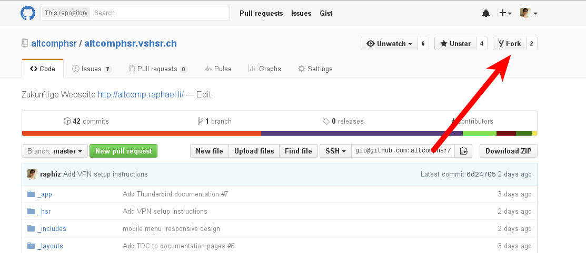

## Github Contribution Checkliste
1. Projekt auswählen
    * Arbeit für ein bekanntes Projekt
        * Eigenes Problem → Am Besten neues Ticket erstellen und abklären, ob diese Funktion/Fehler bereits bekannt und erwüncsht ist und wie bzw. wo es implementiert werden kann.
        * Durchsuchen des Issue Trackers auf ein geeignetes Issue
            * Label "help wanted", "easy fix", "up for grabs" usw.
    * Arbeit an einen Populären / "Hilfsbedürftigen" Projekts
        * [Project showcases](https://github.com/explore)
        * Github Suche - Bsp. [label:"help wanted"](https://github.com/search?q=label%3A%22help+wanted%22&type=Issues) usw.
    * Prüfe ob das Projekt noch Lebt - nicht dass die Arbeit für die Tonne ist
    * Prüfen der Software-Lizenz
2. Anleitungen/Richtlinien für Contribution lesen
    * Typischerweise gibt es Dokumente (`CONTRIBUTING.md`, `CONTRIBUTE.md`, `CONVENTIONS.md` oder ein Abschnitt in der `README.md`), wo die Maintainer beschreiben wie man Vorgehen möchte.
    * Man sollte sich unbedingt an diese Richtlinien halten
    * Beispiel Linux Kernel: Mirror auf Github - es werden keine Pull-Request & Issues akzeptiert
3. Projekt Forken
    
4. Geforktes Projekt klonen
    ```bash
    $ git clone <fork-repo-url>
    $ cd <dir>
    ```
5. Geklontes Projekt einrichten
    ```bash
    $ git remote add upstream <original-repo-url>
    ```
6. Neuer Branch Erstellen
    * Kurzer und beschreibender Name verwenden
    ```bash
    $ git checkout -b <branch-name>
    ```
7. Änderungen umsetzen
    * Fokus auf genau eine Funktion
    * Sinnvolle Commits (und Commit-Messages)
    * Neue Branches (und Pull-Request) für andere Features
    * Änderungen vom upstream (original Projekt) regelmässig (mindestens vor jedem push push) mergen your changes to origin (your fork)

    ```bash
    $ git fetch upstream
    $ git rebase upstream/master
    ```

8. Pull-Request erstellen
    * Geht alles noch und sind Guidelines eingehalten?
        * Funktionieren noch alle Tests?
        * Müssen noch Tests geschrieben werden?
    * Änderungen pushen
    ```bash
    $ git push origin <branch-name>
    ```
    * Auf der Übersichtsseite des Forks den Branch auswählen
    * Den Branch auswählen und einen neuen Pull-Request starten.
    
    * Ausführliche Beschreibung und Referenzen/Beweggründe notieren
9. Weiterverfolgen
    * Warten auf Feedback → Benachrichtigung erfolg automatisch per E-Mail.
    * Änderungen mit dem Maintainer disskutieren und eventuelle Änderungen vornehmen.
    ```bash
    $ git fetch upstream
    $ git rebase upstream/master
    $ # do changes...
    $ git push origin <branch-name>
    ```
10. Aufräumen
    * Nachdem dein beitrag gemerged (oder abgelehnt) wurde kann der lokale Branch und der Remote-Branch auf dem Fork gelöscht werden
    ```bash
    $ # Lokaler Branch löschen
    $ git branch -D BRANCH_NAME
    $ # Remote Branch löschen
    $ git push origin --delete BRANCH_NAME
    ```
