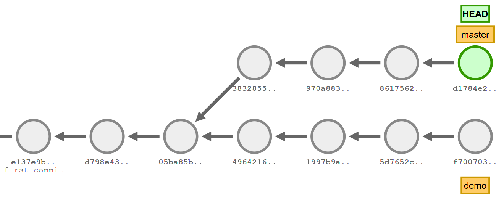
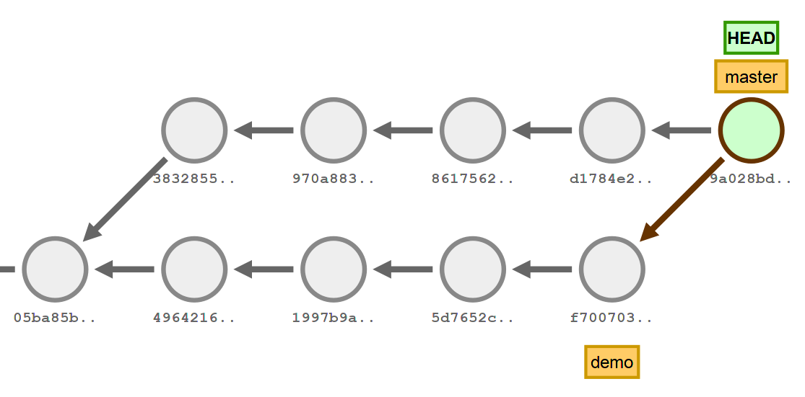

# Branching?

_[Öffne Explain Git im Zen Mode](http://onlywei.github.io/explain-git-with-d3/)_

Konzept "Commit Graph" - Jeder Commit hat ein Parent. (ja eigentlich 2 aber das mal der Einfachheithalber weglassen)

Ein Branch ist, wenn wir von der Hauptlinie abweichen.



Hat jemand mit branches in **CVS oder SVN** zu tun gehabt? Dort ist das **sehr aufwändig**, viele Dateien werden kopiert unsw.

Branching sind in git ein **killer Feature**. Branches zu erstellen und zu wechseln geht extrem schnell - mehr dazu in gleich.

Dadurch werden ganz **neue Workflows** möglich - darum nutzt diese Funktion unbedingt!

## Der Master-Branch
Der Master-Branch ist "by convention" der stabile Zweig. Theoretisch könnte man das beliebig machen - es macht aber Sinn (vorallem auf Github) diesen Branch immer stabil zu halten.

## HEAD
HEAD: Pointer auf "Wo wir sind" (cat .git/HEAD)

> The HEAD file is a symbolic reference to the branch you’re currently on. By symbolic reference, we mean that unlike a normal reference, it doesn’t generally contain a SHA-1 value but rather a pointer to another reference.

## Zwischen Branches wechseln

* Als erstes machen wir einen neuen Branch
* Wie könnte das auf commit Graph aussehen?
```bash
# Im Explain Git
$ git checkout -b testing
```
* Nun können wir auf diesem Zweig arbeiten
```bash
$ git commit
$ git commit
$ git commit
$ git commit
```
* Und nun doch noch was auf dem Master?
* Dafür wieder den master branch auschecken - wie sieht das im Graph aus?
* Was wird dann wohl im arbeitsverzeichniss passieren?
    * git checkout wechselt die Dateien im Arbeitsverzeichnis aus!

```bash
$ git checkout master
$ git commit
$ git commit
```

Um herauszufinden, auf welchem Branch man gerade ist, das kommando `git branch` verwenden

```bash
$ git branch
```

➪ Wollt ihr das kurz ausprobieren?

### Hinter den Kulissen: Branches als Zeiger auf Commits

Ein Branch ist nur ein Zeiger (Siehe Explain Git)
Glaubt ihr mir nicht?

```bash
cat .git/refs/heads/master
git show <hash>
```

## Änderungen Zusammenfügen

* Wie können Branches vereint werden?

Es gibt zwie Strategien - Beide haben ihre Berechtigungen. Wir fokussieren uns hier auf Merge - rebase hat seine Berechtigung, ist aber am Anfang verwirrend. Fokussiert euch auf Merge - macht euch vertraut damit und wenn ihr ein total unübersichtlicher Graph habt, dann lest mal über rebase nach :wink:

### Merge
Einziger Fall, wo ein Commit Zwei Parents hat. Sehr Intuitiv - einfach beide Stränge zusammenfügen.



### Rebase

(Hängt die Commits so an, als hätten sie linear stattgefunden.)

## Übung

Drei Beispiele
* Projekt `Branching1`: Ein einfacher Merge - ohne Konflikt
* Projekt `Branching2`: Ein Merge - mit Konflikt
    * Schauen wir im Plenum kurz an, wenn Problem auftritt
* Versucht einen Merge-Konflikt selbst zu Produzieren.
➪ Beispiele Vorbereiten & auf Stick


# Weiteres

## Letzter Commit auf einen neuen Branch verschieben

Pro Tip:

```bash
# Neuer Branch erstellen
# aber HEAD auf master lassen
$ git branch <new-branch-name>

# Auf den Commit vorher zurücksetzen
# Vorsicht! Böse
$ git reset --hard HEAD~

# Am neuen branch weiter arbeiten
$ git checkout <new-branch-name>
```
