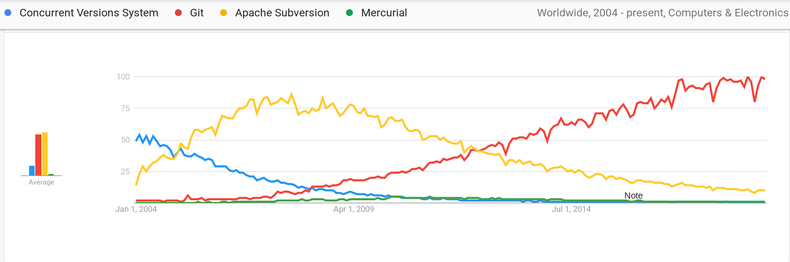

<!-- $theme: default -->

<!-- Presentation made with [Marp](https://yhatt.github.io/marp/) -->
# Git & Github Workshop
# 

###### open\HSR ( [@openhsr](https://github.com/openhsr) )
---
## Motivation
<div style="display: flex; flex-direction: row; align-content: space-between;">
  <p style="width: 45%">
    
  </p>
  <div style="width:55%; font-size: 0.8em;">
      <br>
      <p>If that doesn't fix it, git.txt contains the phone number of a friend of mine who understands git.</p>
      <p>Just wait through a few minutes of</p>
      <blockquote>It's really pretty simple, just think of branches as...</blockquote>
      <p>and eventually you'll learn the commands that will fix everything.</p>
    <br>
    <p><a href="https://xkcd.com/1597/">https://xkcd.com/1597/</a></p>
  </div>
</div>

---

# Vorbereitung
<br>

## 📝 Git installiert
## 📡 Github Account
## 🧰 Git Shell

---

# Regeln?

## ⁉️ Fragen? Fragen!
## ✋ Bei unklarheiten: Stop!
## ⏳ Pause?


---


<p>
<h2> Wozu Versionskontrolle?</h2>

</p>

---

## Zentrale Versionskontrollsysteme


---

## Dezentrale Versionskontrollsysteme
<p style="text-align: center">

</p>


---
# Git



<span style="font-size: 1rem">(Interesse in Prozent. Source: [Google Trends](https://trends.google.com/trends/explore?cat=5&date=all&q=%2Fm%2F09d6g,%2Fm%2F05vqwg,%2Fm%2F012ct9,%2Fm%2F08441_))</span>

---

## Git Kommandozeilen Philosophie

```bash
git <verb>

git help
```

---

# Git Config: Name und E-Mail
Prüfen, ob folgendes Sinn macht:
```bash
$ git config --global user.name
$ git config --global user.email
```

Falls nicht, bitte korrigieren:
```bash
git config --global user.name "Maria Muster"
git config --global user.email  "maria.muster@hsr.ch"
```
(Achtung: Wird veröffentlicht mit `git push`!)