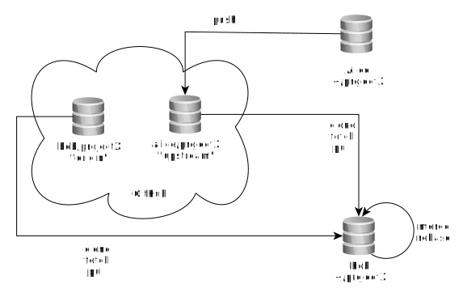
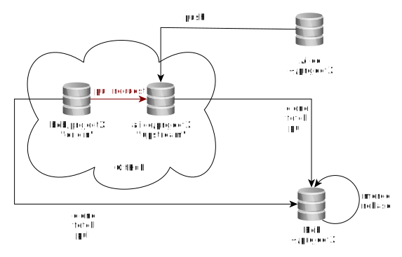

<!-- $theme: default -->

<!-- Presentation made with [Marp](https://yhatt.github.io/marp/) -->
# Git & Github Workshop
# 

###### open\HSR ( [@openhsr](https://github.com/openhsr) )
---

# GitHub bietet...

* **Git Hosting**
* **Pull Requests** aka "Github Flow" - mehr dazu später!
* **Issue Tracker**
* Website Hosting (Statische Webseiten mit Jekyll)
* Integration in Drittdienste
  * Bsp. Continous integration mit Travis-CI usw.
* Vieles, vieles mehr...

---

# Git Remotes

**Remote:** Kopien/Versionen des Git-Repositories, welches (typischerweise) im Internet gehostet ist.

<div style="text-align: center">
  


</div>

---

# Exkurs: Protokolle

## HTTP: `https://github.com/openhsr/verein.git`

## SSH: `git@github.com:openhsr/verein.git`

## (Lokales Dateisystem)

---

# Neues Remote & Push

```bash
# Mit HTTP:
git remote add origin https://github.com/user/repo.git
# oder alternativ mit SSH:
git remote add origin git@github.com:user/repo.git
```

```bash
git push origin master
```

---

# Clone
`git help clone`:
```bash
git clone <repository> [<directory>]
```

also z.B:
```bash
git clone https://github.com/openhsr/verein.git
```

---

# Pull

```bash
git fetch
# Remote-Änderungen sind jetzt nur in origin/master

git merge origin/master
# Jetzt auch im aktuellen branch (master)
```

Alles in einem:

```bash
git fetch --rebase
# oder noch einfacher:
git pull
```

---

# Repetition an der Grafik


<div style="text-align: center">
  


</div>

---

# 🍽️ GitHub Flow

Prozess, wie zusammengarbeitet wird auf GitHub.

1. *Fork* (=Kopie) vom Originalprojekt auf GitHub anlegen
2. Änderungen auf *Fork* umsetzen
   1. `git clone <fork>`
   2. `git add`; `git commit`
   3. `git push` (zum Fork)
4. Erstellen von *Pull Request* mit Änderungen
   <small>vom Fork zum Originalprojekt</small>
6. Originalprojekt übernimmt / *Merged* den *Pull Request*
   <small>oder erbittet Änderungen /  lehnt diesen ab</small>

---

# ...und nochmal diese Grafik


<div style="text-align: center">
  


</div>

---

# 📨 Gästebuch

### ➡️ Fork https://github.com/openhsr/git-github-workshop/
### ➡️ `git clone`; `git checkout guestbook`
### ➡️ `git add  VornameName.md`; `git commit`
### ➡️ `git push`
### ➡️ Open Pull Request
